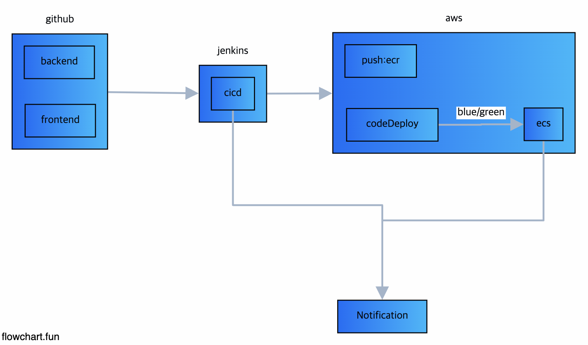

# ecs-cicd-pipeline



## Todo

- [ ] Application
  - [x] Create Node Backend Server
  - [ ] Create Static Page
- [ ] AWS Resource
  - [x] VPC
  - [x] EC2 (Jenkins)
  - [x] ALB (Jenkins + ECS)
  - [x] ECR
  - [x] ECS (Blue/green + Auto Scaling)
  - [ ] CloudFront
  - [ ] S3
- [ ] CI/CD
  - [x] Git Webhoook trigger on Jenkins
  - [x] Slack Notification
- [ ] Test
  - [ ] Stress Test (Auto Scaling)
  - [ ] Deploy Test (Blue/Green)

## Rolling Update vs Blue/Green vs Canary 배포 이해하기

- 공통점 (셋다 무중단 배포임)
- 예전에는 Nginx를 80, 81번 두개를 두어서 트래픽을 바꿔서 무중단 배포를 진행했었는데.. 시대가 많이 바뀌었다.

> Rolling Update

- 사용중인 인스턴스 내에서 새 버전을 점진적으로 교체
- 서비스 중인 인스턴스 하나를 LB에서 Routing 하지 않고 -> 새 버전을 적용한 후 다시 라우팅하도록 한다.

  ```
    - 4개의 인스턴스가 존재한다 (ALB를 모두를 쳐다보고 있음)
    - 2개를 Routing을 끊고 새로운버전을 적용
    - 다시 라우팅 적용 (New Instance 2)
    - 구 버전의 Routing을 끊고 새로운 버전을 적용
    - 다시 라우팅 적용 (ReNew Instance 2)

    > 장점
    - 간단하다.
    - 추가적인 인스턴스를 늘리지 않고 현재 Scaling된 인스턴에스에만 적용가능함 (만약 1개라면? -> 의미없는 듯...)

    > 단점
    - 2개를 끊기 때문에 기존 인스턴스에 트래픽이 쏠리는 현상 (다시 연결될때까지...)
    - 배포가 진행될때마다 신버전과 구버전의 호환성문제가 생긴다 (2 / 2) => 사용자들은 균형잡힌 서비스를 받지 못한다.
  ```

> Blue/Green 배포

- Blue (Old) , Green (New)
- 운영중인 구버전과 동일하게 신버전의 인스턴스를 구성한 후 로드밸런서를 통해 모든 트래픽을 한번에 신버전으로 전환한다

  ```
    - 4개의 1.0ver 인스턴스가 존재한다.
    - 4개의 1.1ver 새로운 버전의 인스턴스를 추가적으로 만든다 (총 8개)
    - AllatOnce or 5, 10 분당 트래픽을 흘려보낸 이런 옵션을 통해서 배포한다.
    - 4개의 1.1ver 새로운 버전의 인스턴스로 트래픽이 가면 -> 1.0ver 인스턴스는 없어진다.

    > 장점
    - 구버전의 인스턴스가 그대로 남아있어서 롤백이 쉬움
    - 구버전의 환경을 다음배포에 재사용
    - 운영환경에 영향을 주지 않고 새버전 테스트 가능

    > 단점
    - 시스템 자원이 2배로 필요함
    - 새로운 환경의 대한 테스트가 전제 되어야 함 (ALB Target group이 2배로 듬)
  ```

> Canary 배포

- Blue/Green은 사실 어떻게 보면 AllAtOnce에 개념에 가까움
- 기존의 Blue/Green과 같으나 트래픽을 조금씩 흘려보낸다는 점에서 Canary 배포형식이 됨

## ...

- DockerFile에서 BuildStage는 가벼운 이미지를 쓰는게좋음... 근데 실제 Production 이미지는 alpine이미지를 쓰면안됨
  - alpine 이미지는 exec format error 가 난다. (docker exec -it <container> /bin/bash)
  - ECS TaskDefinition에서 awslogs를 설정하면 TaskDefinition이 직접 /bin/bash로 들어가서 로그를 추출하는데, alpine이미지는 그게 안됨...
- ECS 에서 RDS 연결할때는 host가 localhost다. 생각해보면 같은 subnet내에서동작한다면 localhost지...
- RDS에서 SG를 ECS에 SG로 연결을 해야 함 (3306 - ECS SG) => ALB가 아님
- ECS ERROR

  ```
  1. exec /usr/local/bin/docker-entrypoint.sh: exec format error
  ENTRY_POINT를 그냥 node dist/index.js로 수정

  2. exec /usr/local/bin/node: exec format error
  BASE Image의 Platform을 수정했음
  FROM --platform=linux/amd64 node:16-alpine

  3. MYSQL Error가 난다...
  HOST를 ... rds의 endpoint로 뒀어야 했음...

  - vpc의 dns 설정을 했어야 했음
  resource "aws_vpc" "vpc" {
    cidr_block           = local.vpc_cidr
    enable_dns_support   = true # Enable DNS resolution for the VPC
    enable_dns_hostnames = true # Enable DNS hostnames for the VPC
    tags = {
      Name = "${local.prefix}-vpc"
    }
  }

  - RDS의 public_asssible = true, SG를 허용 해야 함

  resource "aws_db_instance" "rds" {
    ...
    publicly_accessible = true
    ...
  }

  ```
